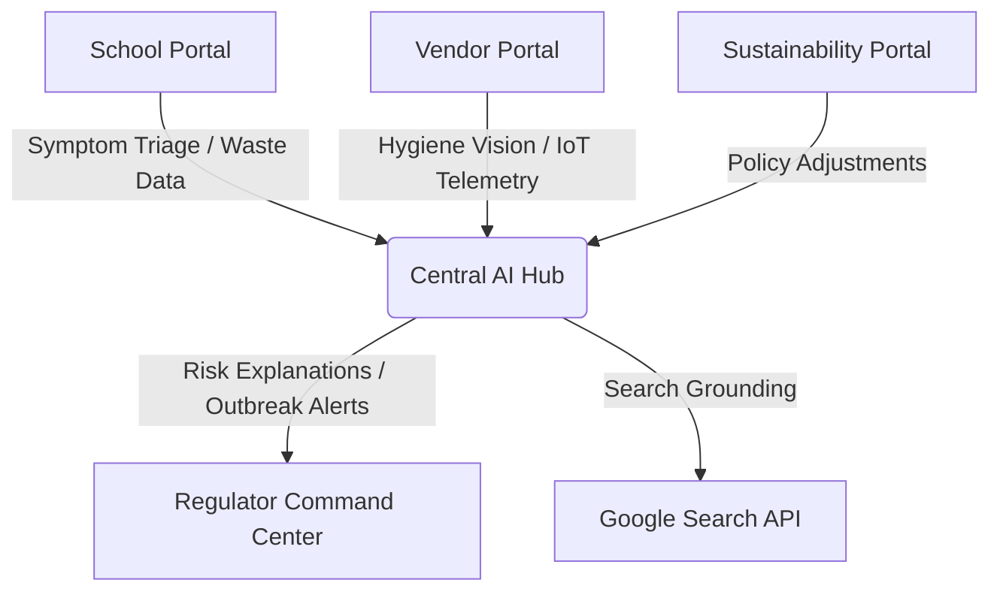

# System Architecture 🏗️

SafeServe MBG is designed as a **Unified Safety Intelligence Platform**. It employs a multi-tenant portal architecture to connect all stakeholders in Indonesia's food safety ecosystem.

## High-Level Overview

The platform operates on a "Digital Shield" philosophy, where data flows from the edges (Schools/Vendors) to a centralized Command Center (Regulators).

## Core Components

### 1. The Intelligence Layer (`geminiService.ts`)
The heart of SafeServe is the **Google Gemini API** integration. We utilize:
*   **Gemini 3.1 Flash/Pro**: For high-speed reasoning and complex food safety triage.
*   **Multimodal Vision**: Analyzes vendor kitchen photos to detect hygiene non-compliance.
*   **Search Grounding**: Injects real-time regional news and stability data into risk models via the `googleSearch` tool.
*   **Structured Outputs**: Uses `responseSchema` to ensure AI decisions are returned in deterministic JSON for use in audit dossiers.

### 2. Portal Architecture
*   **Regulator Dashboard**: A "War Room" view for national oversight, featuring a Monte Carlo **Outbreak Simulator**.
*   **Vendor Portal**: Focuses on digital transformation for local UMKM, handling cold-chain IoT and supply traceability.
*   **School Portal**: Minimalist interface for staff to report illness and verify nutritional compliance.
*   **Sustainability Portal**: Implements "Active Governance," using AI to suggest portion calibrations and monitor waste.

### 3. State & Safety Management
*   **Circuit Breakers**: Implemented in `geminiService.ts` to prevent API cascading failures during quota exhaustion.
*   **Integrity Proofs**: Simulation of a blockchain-backed ledger where safety logs (audits, temperatures) are "hashed" and stored immutably.

## Technology Stack
*   **Frontend**: React 19 (Strict Mode), TypeScript.
*   **Styling**: Tailwind CSS 4 (Modern, fast, utility-first).
*   **Visualization**: Recharts for telemetry and benchmark analytics.
*   **Icons**: Lucide React.

## Deployment
The app is optimized for edge deployment on platforms like Vercel, ensuring low-latency access for regional school administrators across Indonesia.

---
For technical inquiries, contact [support@elpeef.com](mailto:support@elpeef.com).